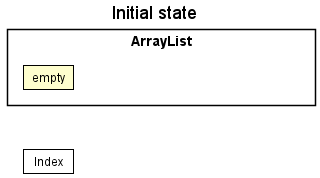
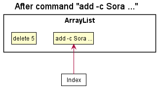
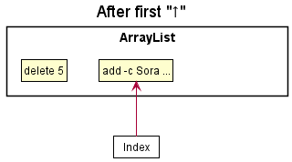
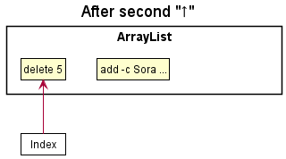
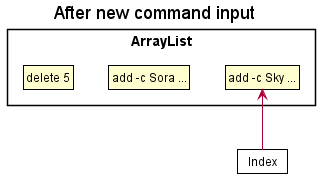
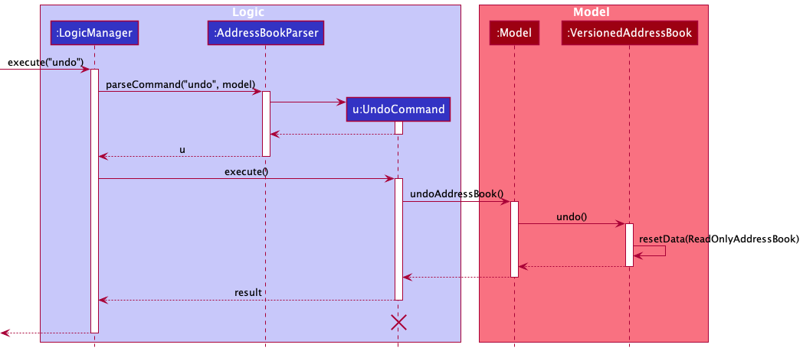

## Table of Contents

1. [Introduction](#1-Introduction) 
1. [Setting up & getting started](#2-setting-up--getting-started) 
1. 

<a href="#3-design">Design</a>

        3.1 <a href="#31-architecture">Architecture</a> 
        3.2 <a href="#32-ui-component">UI component</a> 
        3.3 <a href="#33-logic-component">Logic component</a> 
        3.4 <a href="#34-model-component">Model component</a> 
        3.5 <a href="#35-storage-component">Storage component</a> 
        3.6 <a href="#36-common-classes">Common classes</a> 
   

1. 

<a href="#4-implementation">Implementation</a>

        4.1 <a href="#41-add-clientproduct-feature">Add Client/Product Feature</a> 
        4.2 <a href="#42-delete-clientproduct-feature">Delete Client/Product Feature</a> 
        4.3 <a href="#43-edit-clientproduct-feature">Edit Client/Product Feature</a> 
        4.4 <a href="#44-find-clientproduct-feature">Find Client/Product Feature</a> 
        4.5 <a href="#45-view-clientproduct-feature">View Client/Product Feature</a> 
        4.6 <a href="#46-command-history-feature">Command History Feature</a> 
        4.7 <a href="#47-proposed-undoredo-feature">[Proposed] Undo/Redo Feature</a> 
        4.8 <a href="#48-proposed-data-archiving">[Proposed] Data archiving</a> 
   

1. [Documentation, logging, testing, configuration, dev-ops](#5-documentation-logging-testing-configuration-dev-ops)
1. 

<a href="#6-appendix-requirements">Appendix: Requirements</a>

        6.1 <a href="#61-product-scope">Product scope</a> 
        6.2 <a href="#62-user-stories">User stories</a> 
        6.3 <a href="#63-use-cases">Use cases</a> 
        6.4 <a href="#64-non-functional-requirements">Non-Functional Requirements</a> 
        6.5 <a href="#65-glossary">Glossary</a> 
   

1. 

<a href="#7-appendix-instructions-for-manual-testing">Appendix: Instructions for manual testing</a>

        7.1 <a href="#71-launch-and-shutdown">Launch and shutdown</a> 
        7.2 <a href="#72-viewing-help">Viewing help</a> 
        7.3 <a href="#73-deleting-a-clientproduct">Deleting a client/product</a> 
        7.4 <a href="#74-saving-data">Saving data</a> 
   

--------------------------------------------------------------------------------------------------------------------

## 1. Introduction

**Sellah** is a desktop application optimized for online sellers who prefer using a `Command Line Interface (CLI)` over
the `Graphical User Interface (GUI)`. It is used to keep track of the contact information of your clients and details of
the products in your inventory, as well as details of the orders placed by your clients.

The purpose of this developer guide is to aid any curious or interested contributor in developing Sellah further by 
providing more insight on how the features were implemented.

--------------------------------------------------------------------------------------------------------------------

## 2. Setting up & getting started

Refer to the guide [_Setting up and getting started_](SettingUp.md).

1. Ensure that Java 11 and IntelliJ Idea (or your preferred Java IDE) are installed in your computer.
1. Fork the Sellah repo from [here](https://github.com/AY2122S1-CS2103T-T12-1/tp), and clone the fork into your computer.
1. Configure the JDK in IntelliJ Idea to use JDK 11 by following instructions from [here](https://www.jetbrains.com/help/idea/sdk.html#set-up-jdk).
1. Import the project as a Gradle project.
1. If you had previously disabled the Gradle plugin, go to `File → Settings → Plugins` to re-enable them.
1. Click on Import Project and select the build.gradle file.
1. Navigate to the Sellah class via the path `src → main → java → Main` and click on it.
1. Press run on the `Main()` method of Sellah or run `gradle run`.

If the set up process had been completed successfully, you should see the GUI similar to the below：

--------------------------------------------------------------------------------------------------------------------

## 3. Design

### 3.1 Architecture

The ***Architecture Diagram*** given above explains the high-level design of the App.

Given below is a quick overview of main components of Sellah and how they interact with each other.

**Main components of the architecture**

**`Main`** has two classes called
[`Main`](https://github.com/AY2122S1-CS2103T-T12-1/tp/tree/master/src/main/java/seedu/address/Main.java) and
[`MainApp`](https://github.com/AY2122S1-CS2103T-T12-1/tp/tree/master/src/main/java/seedu/address/MainApp.java). It is
responsible for,

* At app launch: Initializes the components in the correct sequence, and connects them up with each other.
* At shut down: Shuts down the components and invokes cleanup methods where necessary.

[**`Commons`**](#common-classes) represents a collection of classes used by multiple other components.

The rest of the App consists of four components.

* [**`UI`**](#ui-component): The UI of the App.
* [**`Logic`**](#logic-component): The command executor.
* [**`Model`**](#model-component): Holds the data of the App in memory.
* [**`Storage`**](#storage-component): Reads data from, and writes data to, the hard disk.

**How the architecture components interact with each other**

The *Sequence Diagram* below shows how the components interact with each other for the scenario where the user issues
the command `delete -c 1`.

Each of the four main components (also shown in the diagram above),

* defines its *API* in an `interface` with the same name as the Component.
* implements its functionality using a concrete `{Component Name}Manager` class (which follows the corresponding
  API `interface` mentioned in the previous point.

For example, the `Logic` component defines its API in the `Logic.java` interface and implements its functionality using
the `LogicManager.java` class which follows the `Logic` interface. Other components interact with a given component
through its interface rather than the concrete class (reason: to prevent outside component's being coupled to the
implementation of a component), as illustrated in the (partial) class diagram below.

The sections below give more details of each component.

### 3.2 UI component

The **API** of this component is specified in
[`Ui.java`](https://github.com/AY2122S1-CS2103T-T12-1/tp/tree/master/src/main/java/seedu/address/ui/Ui.java)

The UI consists of a `MainWindow` that is made up of parts `CommandBox`, `ResultDisplay`, `ClientListPanel`,
`ProductListPanel`, `ClientCard`, `ProductCard`, `HelpMessage`, `ViewMoreClient`, `ViewMoreProduct`, `PieChartSalesView`
`StatusBarFooter` and `HelpWindow`. All these, including the `MainWindow`, inherit from the abstract `UiPart` class 
which captures the commonalities between classes that represent parts of the visible GUI. In addition, `HelpMessage`, 
`ViewMoreClient`, `ViewMoreProduct` and `PieChartSalesView` extends from `SecondPanel` which displays the results of
view, stat and help command.

The `UI` component uses the JavaFx UI framework. The layout of these UI parts are defined in matching `.fxml` files that
are in the `src/main/resources/view` folder. For example, the layout of the
[`MainWindow`](https://github.com/AY2122S1-CS2103T-T12-1/tp/tree/master/src/main/java/seedu/address/ui/MainWindow.java)
is specified in
[`MainWindow.fxml`](https://github.com/AY2122S1-CS2103T-T12-1/tp/tree/master/src/main/resources/view/MainWindow.fxml)

The `UI` component,

* executes user commands using the `Logic` component.
* listens for changes to `Model` data so that the UI can be updated with the modified data.
* keeps a reference to the `Logic` component, because the `UI` relies on the `Logic` to execute commands.
* depends on some classes in the `Model` component, as it displays `Client` or `Product` object residing in the `Model`.

### 3.3 Logic component

**API** :
[`Logic.java`](https://github.com/AY2122S1-CS2103T-T12-1/tp/tree/master/src/main/java/seedu/address/logic/Logic.java)

Here's a (partial) class diagram of the `Logic` component:

How the `Logic` component works:

1. When `Logic` is called upon to execute a command, it uses the `AddressBookParser` class to parse the user command.
1. This results in a `Command` object (more precisely, an object of one of its subclasses e.g., `AddClientCommand`)
   which is executed by the `LogicManager`.
1. The command can communicate with the `Model` when it is executed (e.g. to add a person).
1. The result of the command execution is encapsulated as a `CommandResult` object which is returned back from `Logic`.

The Sequence Diagram below illustrates the interactions within the `Logic` component for the `execute("delete -c 1")` 
API call.

:information_source: **Note:** The lifeline for `DeleteClientCommandParser` should end at the destroy marker (X) but due
to a limitation of PlantUML, the lifeline reaches the end of diagram.

Here are the other classes in `Logic` (omitted from the class diagram above) that are used for parsing a user command:

How the parsing works:

* When called upon to parse a user command, the `AddressBookParser` class creates an `XYZCommandParser` (`XYZ` is a
  placeholder for the specific command name e.g., `AddClientCommandParser`) which uses the other classes shown above to
  parse the user command and create a `XYZCommand` object (e.g., `AddClientCommand`) which the `AddressBookParser`
  returns back as a `Command` object.
* All `XYZCommandParser` classes (e.g., `AddClientCommandParser`, `DeleteClientCommandParser`, ...) inherit from
  the `Parser`
  interface so that they can be treated similarly where possible e.g, during testing.

### 3.4 Model component

**API** :
[`Model.java`](https://github.com/AY2122S1-CS2103T-T12-1/tp/tree/master/src/main/java/seedu/address/model/Model.java)

The `Model` component,

* stores the address book data i.e., all `Client` and `Product` objects (which are contained in a `UniquePersonList` 
  object and a `UniqueProductList` object respectively).
* stores the currently 'selected' `Client` and `Product` objects (e.g., results of a search query) as two separate 
  _filtered_ lists which are exposed to outsiders as the unmodifiable `ObservableList<Client>` and 
  `ObservableList<Product>` that can be 'observed' e.g. the UI can be bound to the lists so that the UI automatically 
  updates when the data in these lists change.
* stores a `UserPref` object that represents the user’s preferences. This is exposed to the outside as
  a `ReadOnlyUserPref` objects.
* does not depend on any of the other three components (as the `Model` represents data entities of the domain, they
  should make sense on their own without depending on other components)

### 3.5 Storage component

**API** :
[`Storage.java`](https://github.com/AY2122S1-CS2103T-T12-1/tp/tree/master/src/main/java/seedu/address/storage/Storage.java)

The `Storage` component,

* can save both address book data and user preference data in json format, and read them back into corresponding
  objects.
* inherits from both `AddressBookStorage` and `UserPrefStorage`, which means it can be treated as either one (if only
  the functionality of only one is needed).
* depends on some classes in the `Model` component (because the `Storage` component's job is to save/retrieve objects
  that belong to the `Model`)

### 3.6 Common classes

Classes used by multiple components are in the `seedu.addressbook.commons` package.

--------------------------------------------------------------------------------------------------------------------

## 4. Implementation

This section describes some noteworthy details on how certain features are implemented.

### 4.1 Add Client/Product Feature

The add feature adds a new `Client` or `Product` with details into the application. The commands are composed of a
keyword `add` followed by `-c` for adding clients and `-p` for adding products.

Input the command through `MainWindow` of the UI component, which will pass the input string to
`LogicManager`. In `LogicManager`, the `parseCommand` method in `AddressBookParser` will be called, depending on the
command word, the arguments will be used in `AddClientCommandParser` or `AddProductCommandParser` class for parsing.
The `parse` method will return the result as a `Command`, which will be executed in `LogicManager`. After the execution,
data added will be saved to storage.

For `AddClientCommandParser`, a `Model` is needed as it helps to check whether a string representing an `Order` is
valid.

The flow of the sequence diagram would be the same for adding `Products`, but the UI displayed will be different.

#### Design Considerations

**Aspect : How `add` may be executed**

* **Alternative 1 (current choice)** : User can add either a client or a product at a time
    * Pros : Focus on adding a client or product
    * Cons : Might be slow if there are a lot of clients/products to add
* **Alternative 2** : User can add multiple clients or products
    * Pros : Adds multiple clients or products in one command
    * Cons : Difficult to find a client/product since the command can be very long, in this case, updates will have to
      be done through the`edit` command (requires the user to memorise the IDs)

### 4.2 Delete Client/Product Feature

This feature deletes a `Client` or `Product`. When deleting a `Client` or
`Product`, listing all clients/products using the `list -p` or `list -c` command is required.

Input is first handled and retrieved by `MainWindow` in the UI component before being passed to the
`LogicManager` to execute. First, `LogicManager` will call `AddressBookParser`, which will pass the inputs to
`DeleteClientCommandParser`, parsing the inputs and returning a `DeleteClientCommand` or . The command will then be
executed in `LogicManager`, returning a `CommandResult`. `StorageManager` will then attempt to save the current state of
address book into local storage. The `CommandResult` will finally be returned to `MainWindow`, which will display
feedback of the `CommandResult` to the user.

The flow of the sequence diagram would be the same for editing `Products`, but the UI displayed will be different.

#### Design Considerations

**Aspect : How `delete` may be executed**

* **Alternative 1 (current choice)** : User can delete either a client or a product at a time
    * Pros : Focus on deleting a particular client or product
    * Cons : Unable to delete multiple clients or products at the same time
* **Alternative 2** : User can delete multiple clients or products
    * Pros : Deletion of multiple clients or products at the same time
    * Cons : More complex code which would lead to higher amount of error

### 4.3 Edit Client/Product Feature

This feature allows edits the details of a `Client` or `Product` of their choice. When editing a `Client` or
`Product`, at least 1 field is required to be edited.

The input is first handled and retrieved by `MainWindow` in the UI component before being passed to the
`LogicManager` to execute. First, `LogicManager` will call `AddressBookParser`, which will pass the inputs to
`EditClientCommandParser`, parsing the inputs and returning a `EditClientCommand`. The command will then be executed in
`LogicManager`, returning a `CommandResult`. `StorageManager` will then attempt to save the current state of address
book into local storage. The `CommandResult` will finally be returned to `MainWindow`, which will display feedback of
the `CommandResult` to the user.

The flow of the sequence diagram would be the same for editing `Products`, but the UI displayed will be different.

#### Design Considerations

**Aspect : How `edit` may be executed**

* **Alternative 1 (current choice)** : User can edit either a client or a product at a time
    * Pros : Focus on editing a particular client or product
    * Cons : Unable to edit multiple clients or products at the same time
* **Alternative 2** : User can edit multiple clients or products
    * Pros : Saves time if editing a field in all clients or products to the same value
    * Cons : More complex code which would lead to higher amount of error

### 4.4 Find Client/Product Feature

This feature finds a `Client` or `Product` based on their `name`.

Input is first handled and retrieved by `MainWindow` in the UI component before being passed to the
`LogicManager` to execute. First, `LogicManager` will call `AddressBookParser`, which will pass the inputs to
`FindClientCommandParser`, parsing the inputs and returning a `FindClientCommand`. The command will then be executed in
`LogicManager`, returning a `CommandResult`.The `CommandResult` will finally be returned to `MainWindow`, which will
display feedback of the `CommandResult` to the user.

The flow of the sequence diagram would be the same for finding `Products`, but the UI displayed will be different.

#### Design Considerations

**Aspect : How `find` may be executed**

* **Alternative 1 (current choice)** : User can find a client/product by their name
    * Pros : Focus on finding a particular client or product
    * Cons : Unable to find clients or products without name
* **Alternative 2** : Find clients by their details such as name, address, email, etc. and products by their name,
  price, etc.
    * Pros : Able to quickly find clients or products if the respective name cannot be remembered at the moment
    * Cons : More complex code which would lead to higher amount of error

### 4.5 View Client/Product Feature

This feature views the details of the `Client` or `Product` of their choice. When viewing a `Client`, more details such
as `Products` bought before, will be visible to the user. Input is first handled and retrieved by `MainWindow` in the UI
component before being passed to the `LogicManager` to execute.

First, `LogicManager` will call `AddressBookParser`, which will pass the inputs to `ViewClientCommandParser`, parsing
the inputs and returning a `ViewClientCommand`. The command will then be executed in `LogicManager`, returning a
`CommandResult` which will be returned to the user. The flow of the sequence diagram would be the same for viewing
`Products`, but the UI displayed will be different.

#### Design Considerations

**Aspect : How `view` may be executed**

* **Alternative 1 (current choice)** : User can view either a client or product
    * Pros : Focus on a particular client or product
    * Cons : Unable to view multiple clients or products
* **Alternative 2** : User can view multiple clients or products
    * Pros : Easier comparisons between clients or products
    * Cons : More complex code which would lead to higher amount of error

### 4.6 Command History Feature

This feature allows navigation to previous commands using `↑` and `↓` keys.

The command histories are stored in an `ArrayList<String>`, as well as with the help of a `Index`. For every input, it
is stored into the `ArrayList`. `Index` begins at the end of the `ArrayList`. When `↑` is pressed, previous command will
be shown till no more available. `↓` is used to go back to the next command. When the last and latest command stored
in `ArrayList` is reached, the next `↓` will clear the command input field. At any time, user can choose to just stop
and proceed on to edit or input the current history command.

Given below is an example usage scenario and how `↑` and `↓` behaves at each step.

Step 1. The user launches the application for the first time. The `ArrayList` will be initialized but empty as the user
has yet to input any commands. The `Index` however, is set to `null` initially. At this step, neither `↑` and `↓` will
not be usable.

Step 2. The user inputs `delete -c 5` command to delete the 5th client in the address book. `delete -c 5` will be stored
into `ArrayList` and `Index` will be shifted to the newly input command.

Step 3. The user inputs `add -c Sora ...` command to add a new client. `add -c Sora ...` will be stored into `ArrayList`
and `Index` will be shifted to the newly input command.

Step 4. The user presses `↑` key to go back to previous command. The command at `Index`, which is `add -c Sora ...` will
be displayed in the input field.

Step 5. The user accidentally presses `↑` key again. `Index` decrease by 1 and the command, `delete -c 5`, will be
displayed in the input field.

Step 6. The user presses `↓` key to go back to the next command. `Index` increase by 1 and the command,
`add -c Sora ...`, will be displayed in the input field.

Step 7. The user changes the command from `add -c Sora ...` to `add -c Sky ...` and inputs it. `add -c Sky ...` will be
stored into `ArrayList` and `Index` will be shifted to the newly input command.

### 4.7 \[Proposed\] Undo/Redo Feature

#### Proposed Implementation

The proposed undo/redo mechanism is facilitated by `VersionedAddressBook`. It extends `AddressBook` with an undo/redo
history, stored internally as an `addressBookStateList` and `currentStatePointer`. Additionally, it implements the
following operations:

* `VersionedAddressBook#commit()` — Saves the current address book state in its history.
* `VersionedAddressBook#undo()` — Restores the previous address book state from its history.
* `VersionedAddressBook#redo()` — Restores a previously undone address book state from its history.

These operations are exposed in the `Model` interface as `Model#commitAddressBook()`, `Model#undoAddressBook()`
and `Model#redoAddressBook()` respectively.

Given below is an example usage scenario and how the undo/redo mechanism behaves at each step.

Step 1. The user launches the application for the first time. The `VersionedAddressBook` will be initialized with the
initial address book state, and the `currentStatePointer` pointing to that single address book state.

Step 2. The user executes `delete 5` command to delete the 5th person in the address book. The `delete` command calls
`Model#commitAddressBook()`, causing the modified state of the address book after the `delete 5` command executes to be
saved in the `addressBookStateList`, and the `currentStatePointer` is shifted to the newly inserted address book state.

Step 3. The user executes `add n/David …​` to add a new person. The `add` command also calls
`Model#commitAddressBook()`, causing another modified address book state to be saved into the `addressBookStateList`.

:information_source: **Note:** If a command fails its execution, it will not call `Model#commitAddressBook()`, so the
address book state will not be saved into the `addressBookStateList`.

Step 4. The user now decides that adding the person was a mistake, and decides to undo that action by executing the
`undo` command. The `undo` command will call `Model#undoAddressBook()`, which will shift the `currentStatePointer`
once to the left, pointing it to the previous address book state, and restores the address book to that state.

:information_source: **Note:** If the `currentStatePointer` is at index 0, pointing to the initial AddressBook state,
then there are no previous AddressBook states to restore. The `undo` command uses `Model#canUndoAddressBook()` to check
if this is the case. If so, it will return an error to the user rather than attempting to perform the undo.

The following sequence diagram shows how the undo operation works:

:information_source: **Note:** The lifeline for `UndoCommand` should end at the destroy marker (X) but due to a
limitation of PlantUML, the lifeline reaches the end of diagram.

The `redo` command does the opposite — it calls `Model#redoAddressBook()`, which shifts the `currentStatePointer` once
to the right, pointing to the previously undone state, and restores the address book to that state.

:information_source: **Note:** If the `currentStatePointer` is at index `addressBookStateList.size() - 1`, pointing to
the latest address book state, then there are no undone AddressBook states to restore. The `redo` command uses
`Model#canRedoAddressBook()` to check if this is the case. If so, it will return an error to the user rather than
attempting to perform the redo.

Step 5. The user then decides to execute the command `list`. Commands that do not modify the address book, such as
`list`, will usually not call `Model#commitAddressBook()`, `Model#undoAddressBook()` or `Model#redoAddressBook()`. Thus,
the `addressBookStateList` remains unchanged.

Step 6. The user executes `clear`, which calls `Model#commitAddressBook()`. Since the `currentStatePointer` is not
pointing at the end of the `addressBookStateList`, all address book states after the `currentStatePointer` will be
purged. Reason: It no longer makes sense to redo the `add n/David …​` command. This is the behavior that most modern
desktop applications follow.

The following activity diagram summarizes what happens when a user executes a new command:

#### Design considerations:

**Aspect: How undo & redo executes:**

* **Alternative 1 (current choice):** Saves the entire address book.
    * Pros: Easy to implement.
    * Cons: May have performance issues in terms of memory usage.

* **Alternative 2:** Individual command knows how to undo/redo by itself.
    * Pros: Will use less memory (e.g. for `delete`, just save the person being deleted).
    * Cons: We must ensure that the implementation of each individual command are correct.

_{more aspects and alternatives to be added}_

### 4.8 \[Proposed\] Data archiving

_{Explain here how the data archiving feature will be implemented}_

--------------------------------------------------------------------------------------------------------------------

## 5. Documentation, logging, testing, configuration, dev-ops

* [Documentation guide](Documentation.md)
* [Testing guide](Testing.md)
* [Logging guide](Logging.md)
* [Configuration guide](Configuration.md)
* [DevOps guide](DevOps.md)

--------------------------------------------------------------------------------------------------------------------

## 6 Appendix: Requirements

### 6.1 Product scope

**Target user profile**:

* online seller on e-commerce platforms who have a large client base
* has a need to keep track of the manufacturing and delivery of their products as well as the contact information of
  their customers and business partners
* prefer desktop apps over other types
* can type fast
* prefers typing to mouse interactions
* is reasonably comfortable using CLI apps

**Value proposition**: Sellah is an address book containing the contact information and orders related to the clients
and partners. The information and status of each order can also be easily monitored by the user. This product makes it
easy and convenient to track orders and look for future cooperation.

### 6.2 User stories

Priorities: High (must have) - `* * *`, Medium (nice to have) - `* *`, Low (unlikely to have) - `*`

| Priority | As a …​                                    | I want to …​                     | So that I can…​                                                        |
| -------- | ------------------------------------------ | ------------------------------ | ---------------------------------------------------------------------- |
| `* * *`  | new user                                   | see usage instructions         | can refer to them when I forget how to use the application                                                                 |
| `* * *`  | 2nd-time user                              | add a client                   | keep track of the details of a specific client                         |
| `* * *`  | 2nd-time user                              | add a product                  | keep track of the details of a specific product                        |
| `* * * ` | 2nd-time user                              | edit a client                  | edit the details of a specific client                                  |
| `* * * ` | 2nd-time user                              | edit a product                 | edit the details of a specific product                                 |
| `* * * ` | 2nd-time user                              | view a client                  | view the details of a specific client                                  |
| `* * * ` | 2nd-time user                              | view a product                 | view the details of a specific product                                 |
| `* * * ` | 2nd-time user                              | delete a client                | remove client that I no longer need                                    |
| `* * * ` | 2nd-time user                              | delete a product               | remove product that I no longer need                                   |
| `* * `   | 10th-time user                             | list all my clients            | locate a client easily                                                 |
| `* * `   | 10th-time user                             | list all my products           | locate a product easily                                                |
| `* * * ` | 10th-time user                             | see the statistics of the products sold | analyse the consumer pattern and make better decision in the future |

### 6.3 Use cases

(For all use cases below, the **System** is the `Sellah` and the **Actor** is the `user`, unless specified otherwise)

**Use case: UC01 - Add a client/product**

**MSS**

1. User requests to add a new client/product.
2. Sellah adds the client/product.
3. Sellah displays success message and shows the updated list of clients/products.

   Use case ends.

**Extensions**

* 1a. The input parameter(s) is/are invalid.

    * 1a1. Sellah shows an error message.

      Use case resumes at step 1.

* 1b. The command format is incorrect.

    * 1b1. Sellah shows an error message.

      Use case resumes at step 1.

  Use case ends.

**Use case: UC02 - Edit a client/product**

**MSS**

1. User <ins>requests to list clients/products (UC04)</ins>.
2. Sellah shows a list of clients/products.
3. User requests to edit a specific client/product in the list.
4. Sellah edits the client/product.
5. Sellah displays success message and shows the updated list of clients/products.

   Use case ends.

**Extensions**

* 2a. The list is empty.

    * 2a1. Sellah shows an error message.

      Use case ends.

* 3a. The input parameter(s) is/are invalid.

    * 3a1. Sellah shows an error message.

      Use case resumes at step 3.

* 3b. The command format is incorrect.

    * 3b1. Sellah shows an error message.

      Use case resumes at step 3.

**Use case: UC03 - View a client/product**

**MSS**

1. User <ins> requests to list clients/products (UC04) </ins>
2. Sellah shows a list of clients/products.
3. User request to see more information of a specific client/product in the list.
4. Sellah shows the details of the product/item.

User story ends.

**Extensions**

* 2a. The list is empty.

    * 2a1. Sellah shows an error message.

      Use case ends.

* 3a. The input parameter(s) is/are invalid.

    * 3a1. Sellah shows an error message.

      Use case resumes at step 3.

* 3b. The command format is incorrect.

    * 3b1. Sellah shows an error message.

      Use case resumes at step 3.

* 4a. Some optional details are not present.

    * 4a1. Sellah shows a placeholder value at the optional detail.

      Use case ends.

**Use case: UC04 - List all client/product**

**MSS**

1. User requests to list clients/products.
2. Sellah shows a list of clients/products.

   Use case ends.

**Extensions**

* 2a. The list is empty.

    * 2a1. Sellah shows an error message.

      Use case ends.

**Use case: UC05 - Delete a client/product**

**MSS**

1. User <ins>requests to list clients/products (UC04)</ins>.
2. Sellah shows a list of clients/products.
3. User requests to delete a specific client/product in the list.
4. Sellah deletes the client/product.

   Use case ends.

**Extensions**

* 2a. The list is empty.

  Use case ends.

* 3a. The input INDEX is invalid.

    * 3a1. Sellah shows an error message.

      Use case resumes at step 3.

* 3b. The command format is incorrect.

    * 3b1. Sellah shows an error message.

      Use case resumes at step 3.

**Use case: UC06 - Find a client/product**

**MSS**

1. User requests to find a client/product.
2. Sellah finds a list of clients/products.
3. Sellah displays success message and shows the updated list of clients/products.

   Use case ends.

**Extensions**

* 1a. The input parameter is invalid.

    * 1a1. Sellah shows an error message.

      Use case resumes at step 1.

* 1b. The command format is incorrect.

    * 1b1. Sellah shows an error message. Use case resumes at step 1.

* 2a. The list is empty.

    * 2a1. Sellah shows an error message.

      Use case ends.
    

### 6.4 Non-Functional Requirements

1. Should work on any _mainstream OS_ as long as it has Java `11` or above installed.
2. Should be able to hold up to 1000 persons without a noticeable sluggishness in performance for typical usage.
3. A user with above average typing speed for regular English text (i.e. not code, not system admin commands) should be
   able to accomplish most of the tasks faster using commands than using the mouse.

### 6.5 Glossary

* **Mainstream OS**: Windows, Linux, Unix, OS-X, and macOS
* **Private contact detail**: A contact detail that is not meant to be shared with others
* **CLI** - Command Line Interface
* **IntelliJ** - An Integrated Development Environment (IDE) designed for Java software development.
* **UML** - Unified Modeling Language.
* **Terminal/PowerShell** - Any operating system shell with a command-line interface.
* **JDK** - Java Development Kit.

--------------------------------------------------------------------------------------------------------------------

## 7. Appendix: Instructions for manual testing

Given below are instructions to test the app manually.

:information_source: **Note:** These instructions only provide a starting point for testers to work on; testers are
expected to do more *exploratory* testing.

### 7.1 Launch and shutdown

1. Initial launch

    1. Download the latest jar file from [here](https://github.com/AY2122S1-CS2103T-T12-1/tp/releases) and copy into an empty 
       folder

    1. Double-click the jar file Expected: Shows the GUI with a set of sample contacts. The window size may not be
       optimum.

1. Saving window preferences

    1. Resize the window to an optimum size. Move the window to a different location. Close the window.

    1. Re-launch the app by double-clicking the jar file. 
       Expected: The most recent window size and location is retained.

1. Exiting the application

    1. Enter `exit` and press enter or click the exit button 
       Expected: The application exits successfully.

### 7.2 Viewing help

1. Viewing help for Sellah

    1. Enter `help` and press enter 
       Expected: A help message will be shown on the second panel. In addition, a link to Sellah's user guide will also
       pop up.

### 7.3 Deleting a client/product

1. Deleting a client while all clients are being shown

    1. Prerequisites: List all clients using the `list -c` command. Multiple clients in the list.

    1. Test case: `delete -c 1` 
       Expected: First client is deleted from the list. Details of the deleted client shown in the status message.
       Timestamp in the status bar is updated.

    1. Test case: `delete -c 0` 
       Expected: No client is deleted. Error details shown in the status message. Status bar remains the same.

    1. Other incorrect delete commands to try: `delete`, `delete x`, `...` (where x is larger than the list size) 
       Expected: Similar to previous.

1. Deleting a product while all products are being shown

    1. Prerequisites: List all products using the `list -p` command. Multiple products in the list.

    1. Test case: `delete -p 2` 
       Expected: Second product is deleted from the list. Details of the deleted product shown in the status message.
       Timestamp in the status bar is updated.

    1. Test case: `delete -p 0` 
       Expected: No product is deleted. Error details shown in the status message. Status bar remains the same.

    1. Other incorrect delete commands to try: `delete`, `delete x`, `...` (where x is larger than the list size) 
       Expected: Similar to previous.
       

### 7.4 Saving data

1. Dealing with missing/corrupted data files

    1. _{explain how to simulate a missing/corrupted file, and the expected behavior}_
    
