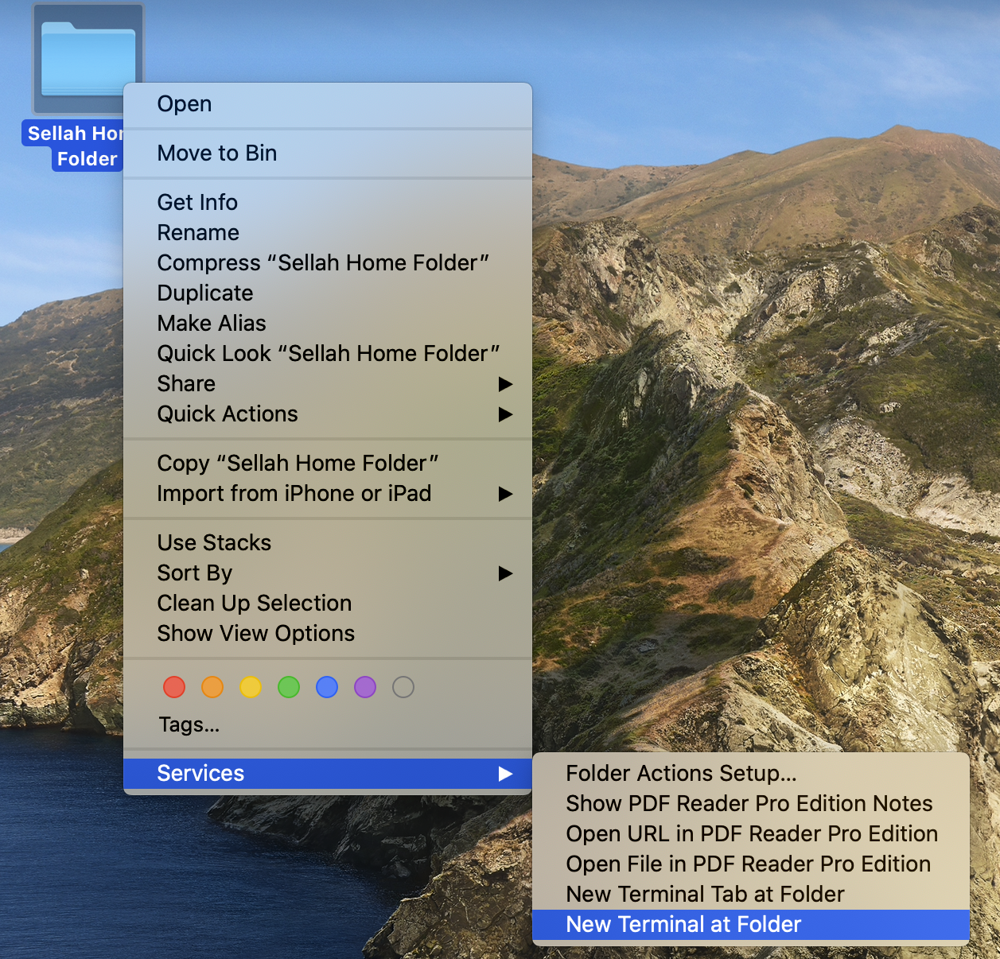
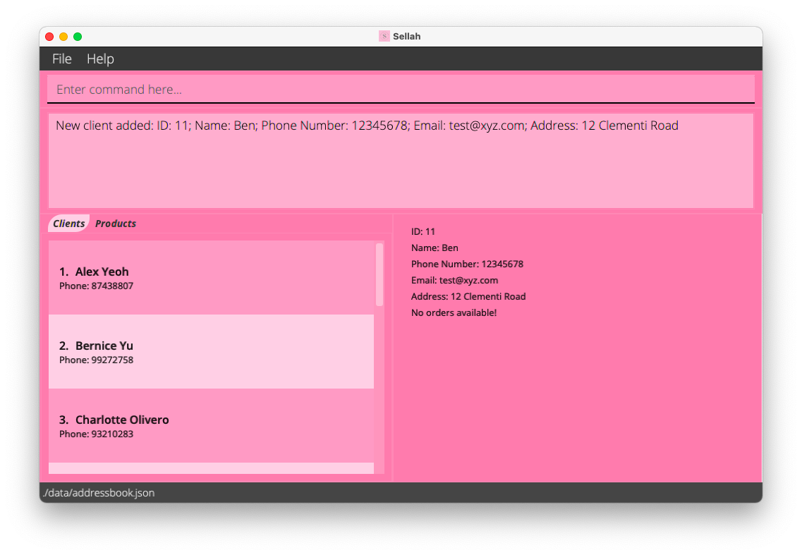
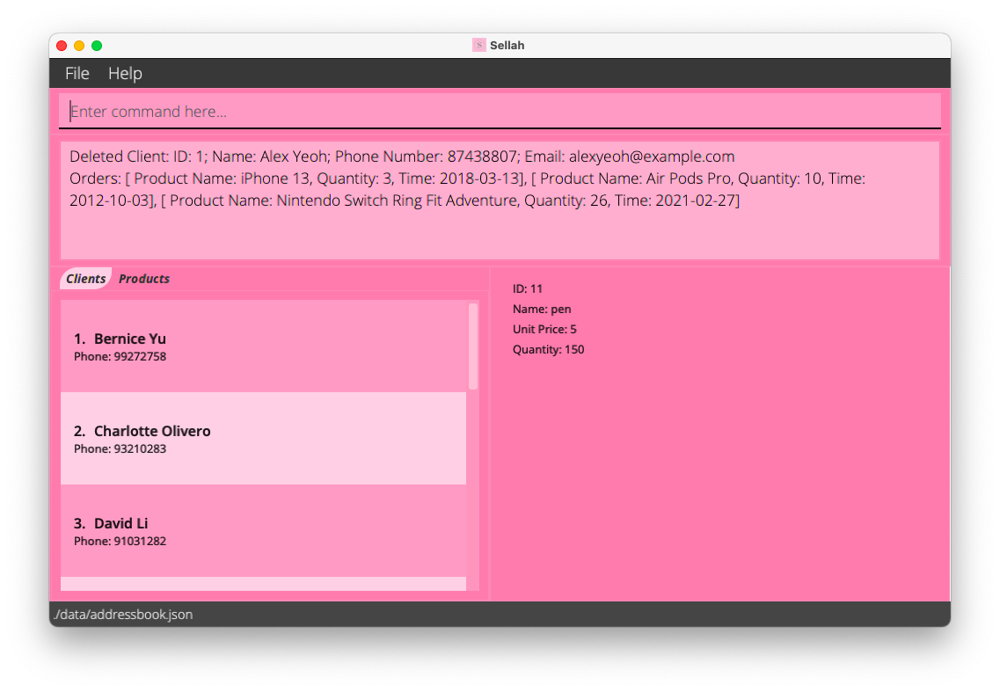
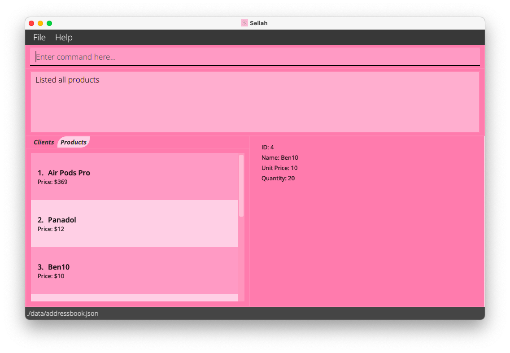
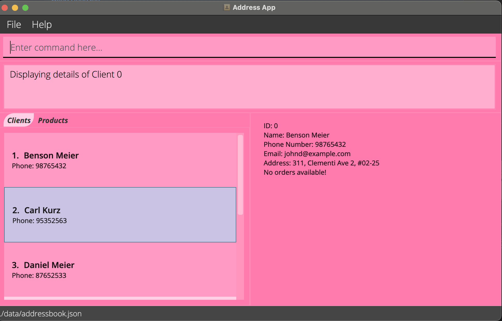
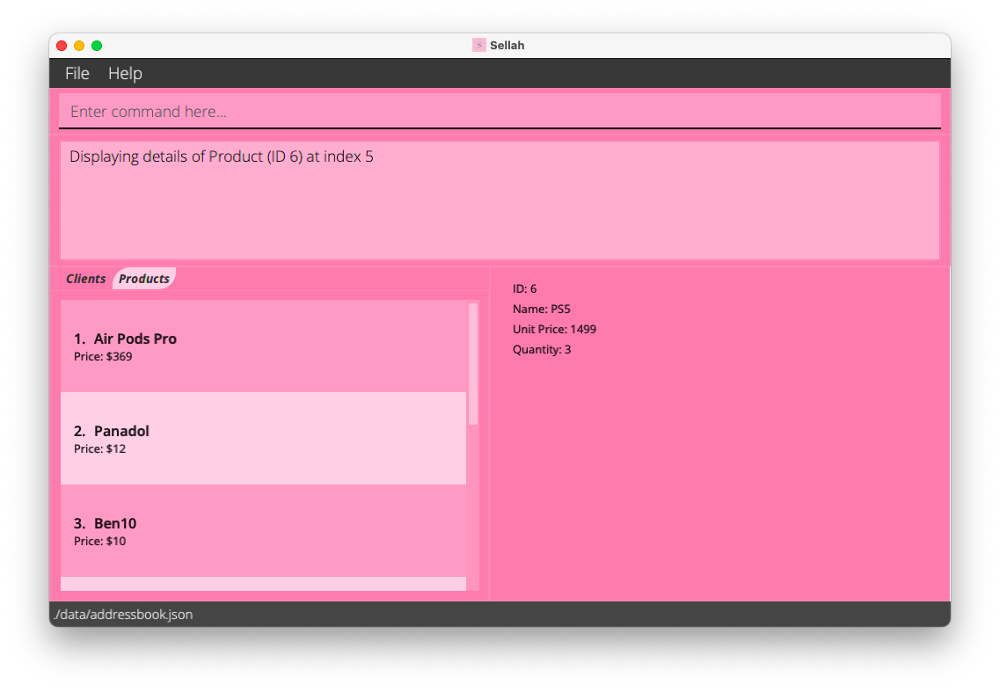
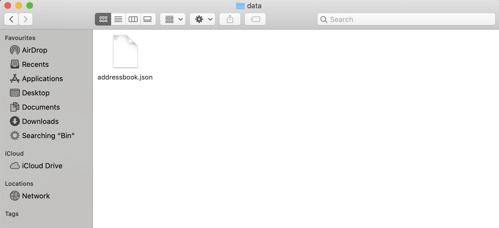

# User Guide for Sellah

## Table of Contents

1. [Introduction](#1-introduction)  
1. [Quick start](#2-quick-start)  
1. 

<a href="#3-about">About</a>

      3.1. <a href="#31-structure-of-the-document">Structure of this Document</a> 
      3.2. <a href="#32-reading-this-document">Reading this Document</a> 
      &nbsp;&nbsp;&nbsp;&nbsp; 3.2.1. <a href="#321-technical-terms">Technical terms</a> 
      &nbsp;&nbsp;&nbsp;&nbsp; 3.2.2. <a href="#322-general-symbols-and-syntax">General Symbols and Syntax</a> 
      &nbsp;&nbsp;&nbsp;&nbsp; 3.2.3. <a href="#323-defining-client-and-product">Defining Client and Product</a> 
   

1. 

<a href="#4-features">Features</a>

      4.1. <a href="#41-getting-help">Getting Help</a> 
      4.2. <a href="#42-add">Add</a> 
      &nbsp;&nbsp;&nbsp;&nbsp; 4.2.1. <a href="#421-adding-a-client">Adding a Client</a> 
      &nbsp;&nbsp;&nbsp;&nbsp; 4.2.2. <a href="#422-adding-a-product">Adding a Product</a> 
      4.3. <a href="#43-delete">Delete</a> 
      &nbsp;&nbsp;&nbsp;&nbsp; 4.3.1. <a href="#431-deleting-a-client">Deleting a Client</a> 
      &nbsp;&nbsp;&nbsp;&nbsp; 4.3.2. <a href="#432-deleting-a-product">Deleting a Product</a> 
      4.4. <a href="#44-edit">Edit</a> 
      &nbsp;&nbsp;&nbsp;&nbsp; 4.4.1. <a href="#441-editing-a-client">Editing a Client</a> 
      &nbsp;&nbsp;&nbsp;&nbsp; 4.4.2. <a href="#442-editing-a-product">Editing a Product</a> 
      4.5. <a href="#45-find">Find</a> 
      &nbsp;&nbsp;&nbsp;&nbsp; 4.5.1. <a href="#451-finding-a-client">Finding a Client</a> 
      &nbsp;&nbsp;&nbsp;&nbsp; 4.5.2. <a href="#452-finding-a-product">Finding a Product</a> 
      4.6. <a href="#46-list">List</a> 
      &nbsp;&nbsp;&nbsp;&nbsp; 4.6.1. <a href="#461-listing-all-clients">Listing all Clients</a> 
      &nbsp;&nbsp;&nbsp;&nbsp; 4.6.2. <a href="#462-listing-all-products">Listing all Products</a> 
      4.7. <a href="#47-view">View</a> 
      &nbsp;&nbsp;&nbsp;&nbsp; 4.7.1. <a href="#471-viewing-a-client">Viewing a Client</a> 
      &nbsp;&nbsp;&nbsp;&nbsp; 4.7.2. <a href="#472-viewing-a-product">Viewing a Product</a> 
      4.8. <a href="#48-clearing-all-data">Clearing the all Data</a> 
      4.9. <a href="#49-navigating-the-command-history">Navigating the Command History</a> 
      4.10. <a href="#410-viewing-statistics">Viewing Statistics</a> 
      4.11. <a href="#411-exiting-sellah">Exiting Sellah</a> 
      4.12. <a href="#412-saving-data">Saving Data</a> 
      4.13. <a href="#413-editing-the-data-file">Editing the Data file</a> 
   

1. [FAQ](#5-faq)  
1. [Command summary](#6-command-summary)  

--------------------------------------------------------------------------

## 1. Introduction

Welcome to the User Guide of **Sellah**!

**Sellah** is a desktop application optimized for online sellers who prefer using a `Command Line Interface (CLI)` over
the `Graphical User Interface (GUI)`. It is used to keep track of the contact information of your clients and details of
the products in your inventory, as well as details of the orders placed by your clients.

**Sellah** uses `CLI`; this means that you operate the application by typing commands into a `Command Box`. If your
typing speed is fast, you can operate the application faster than other `GUI` applications; `GUI` applications allow you
to interact with the application through graphical icons such as buttons.  

You do not have to worry at all even if you are new to CLI applications as this user guide will take you through step 
by step on how various features of the **Sellah** can be utilised, all geared towards providing the best possible 
experience for you.  

If you are interested, jump to [Section 2 - Quick Start](#2-quick-start) to learn how to optimise your inventory using
**Sellah**.  

--------------------------------------------------------------------------

## 2. Quick Start

1. Ensure you have `Java 11` or above installed in your Computer. You can download it from
   [here](https://www.oracle.com/java/technologies/javase/jdk11-archive-downloads.html).

1. Download the latest `sellah.jar` from [here](https://github.com/AY2122S1-CS2103T-T12-1/tp/releases).

1. Copy the file to the folder you want to use as the _home folder_ for your **Sellah**.

1. Double-click the file to start the app. 
   
1. Alternatively, if you wish to open **Sellah** using command prompt or terminal, key in `java -jar Sellah.jar` and 
   press `enter` to launch the **Sellah** application.
   
1. The GUI similar to the below should appear in a few seconds. Note how the app
   contains some sample data. You can use the [`clear`](#48-clearing-all-data) command to purge all data.  
   

1. Refer to the [Features](#4-features) below for details of each command.

> :bulb: Image below shows you how you can open home directory of **Sellah** in command prompt or terminal.

Windows | Mac
------------ | -------------
Key in `cmd` and press enter. | Right click on the folder and click on “New Terminal at Folder”

--------------------------------------------------------------------------

## 3. About

### 3.1 Structure of the Document

The structure of this document is to help you find what you need quickly and easily.

In the next section [Section 3.2 Reading this Document](#32-reading-this-document), you will be able to find definitions
of technical terms, general syntax and format of commands that will be used throughout the guide.

The following section [Section 4 Features](#4-features), documents the main features of **Sellah** and provides
explanations on how to utilise them to its fullest.

Alternatively, if you are looking for a quick summary of the command formats, go
to [Command Summary](#6-command-summary).

### 3.2 Reading this Document

This section provides some common terms and syntax that would be used throughout the document. It is important that you
familiarise yourself with them before moving on to [Section 4 Features](#4-features).

Throughout this guide, [Products](#323-defining-client-and-product) refer to the items in your inventory
and [Clients](#323-defining-client-and-product) refer to the people who have
order [Products](#323-defining-client-and-product) from you.

#### 3.2.1 Technical Terms

The table below explains some technical terms that you may come across throughout the user guide.

| Term | Definition |
|:---:|:----:|
| Command | Keywords that Sellah recognises to invoke specific commands. |
| Parameters | Information to be passed to the Commands. |
| Index | The number next to the list of [Clients](#323-defining-client-and-product) or [Products](#323-defining-client-and-product). |
| ID | Each [Client](#323-defining-client-and-product) or [Product](#323-defining-client-and-product) is associated with a unique numerical `ID`. This number may not always be the same as `Index`. |

#### 3.2.2 General Symbols and Syntax

The table below explains the general syntax used throughout the user guide.

|Syntax| Definition |
|:----:|:----:|
|`...`| Indicates that the parameter before it can be used multiple times, including 0 times. If the parameter is `-o`, some possible usages could be ` `(empty) or `-o 1 -o 2`.|
|`UPPER_CASE` | Name of the parameter. For example, `EMAIL` is a parameter named email. |
|`-lower_case UPPER_CASE` | A parameter field. The name of the parameter is defined in `UPPER_CASE` and `-lower_case` refers to an acronym of `UPPER_CASE`. An example can be `-e abc@gmail.com`.|
|`[-lower_case UPPER_CASE]` | An optional parameter field. Eg `-a A [-b B]` can be used as `-a A -b B` or just `-a A`.|
|:bulb: | An light bulb indicates that the following text is a tip. |

* Parameters can be in any order. 
  e.g. if the command specifies `-pn PHONE_NUMBER -e EMAIL`, then `-e EMAIL -pn PHONE_NUMBER` is also acceptable.

* If a parameter is expected only once in the command, but you specified it multiple times, only the last occurrence of
  the parameter will be taken. 
  e.g. if you specify `-pn 12341234 -pn 56785678`, only `-pn 56785678` will be taken.

* Extraneous parameters for commands that do not take in parameters (such as `exit`) will be ignored. 
  e.g. if the command specifies `exit 123`, it will be interpreted as `exit`.

#### 3.2.3 Defining Client and Product

**Client** refers to the clients that have bought your products before. Each client must have a **Name** and a
**Phone Number**. Optionally, they can have an **Email Address**, a physical **Address** and a list of **Orders**. Every
client command requires a `-c` parameter.

An **Order** refers to a product that the client has ordered. For each order, the **ID** associated to the product, the
**Quantity** and the **Date of Purchase** must be included.

Parameter | Format |
--- | ---
`-n` | Any valid name, only alphabets, numbers and spaces are allowed.   E.g.: `-n Alice Bob`.
`-pn` | A series of 8 positive numbers from 0 to 9.   E.g.: `-pn 12345678`.
`-e` | Any valid email.   E.g.: `-e abc@asdf.com`.
`-a` | Any valid address, spaces are allowed.   E.g.: `-a 12 clementi road`.
`-o` | Each order requires a product id, quantity and a date field that is either in `YYYY/MM/DD` or `MM/DD` and is identified by its own ID.   E.g.: `-o 1 1 1/2` and `-o 3 12 2020/07/09`.

**Product** refers to the items currently in your inventory. Each product must have a **Name**, the **Unit Price**
(cost of 1 item). Optionally, you can add a **Quantity** to the products that indicates the number of that item you have
in your inventory currently. Every product command requires a `-p` parameter.

Parameter | Format |
--- | ---
`-n` | Any valid name, only alphabets, numbers and spaces are allowed.   E.g.: `-n Alienware Aurora R12`.
`-$` | A valid price, optional to specify the cents (2 decimal places).   E.g.: `-$ 10.00` and `-$ 10`.
`-q` | Any positive integer to specify the quantity.   E.g.: `-q 15`.

--------------------------------------------------------------------------

## 4. Features

This section contains the main features of the **Sellah**. To use each feature, you can enter the command associated
with each feature into the CLI.

### 4.1 Getting help

Displays a help message. Format: `help`

Expected Output:

### 4.2 Add

Adds a new client or product to Sellah with an automatically generated ID.

An error message will be displayed if the format of a parameter is incorrect. A different error message will be
displayed if the client or product to be added already exists in Sellah.

#### 4.2.1 Adding a Client

Adds a client with name, phone number and optional email, address and orders.

Format: `add -c NAME -pn PHONE_NUMBER [-e EMAIL] [-a ADDRESS] [-o ORDER]...`

Example: `add -c Ben -pn 98765432` adds a new `Client` `Ben`, whose `PHONE_NUMBER` is `98765432`.

Expected Output:

#### 4.2.2 Adding a Product

Adds a product with name, unit price and optional quantity. If quantity is not specified, the number of product is not
0, but undefined instead.

Format: `add -p NAME -$ UNIT_PRICE [-q QUANTITY]`

Example: `add -p pen -$ 10.00 -q 150` adds a new `Product` `pen` with a `UNIT_PRICE` of `$10.00` and there are `150`
pens in stock.

Expected Output:

### 4.3 Delete

Deletes the specified client/product from Sellah.

An error message will be displayed if the format of a parameter is incorrect. A different error message will be
displayed if the client or product to be deleted does not exist in Sellah.

#### 4.3.1 Deleting a Client

Deletes the client at the specified index from Sellah.

Format: `delete -c INDEX`

Example : `delete -c 1` deletes the client with index 1 from Sellah.

Expected Output:

#### 4.3.2 Deleting a Product

Deletes the product at the specified index in Sellah.

Format: `delete -p INDEX`

Example : `delete -p 1` deletes the product with index 1 from Sellah.

Expected Output:

### 4.4 Edit

Edits an existing client or product in Sellah. You need to provide at least one of the optional field so that Sellah can
update the client or product correctly.

An error message will be displayed if the format of a parameter is incorrect. A different error message will be
displayed if the client or product to be edited does not exist in Sellah.

#### 4.4.1 Editing a Client

Edits the client (if he exists) at the specified index in Sellah.

Format : `edit -c INDEX [-n NAME] [-pn PHONE_NUMBER] [-e EMAIL] [-a ADDRESS] [-o ORDER]...`

Example : `edit -c 1 -n Ben` Edits the name of the client with `INDEX` of `1` to `Ben`.

Expected Output:

**:bulb: Notes on `ORDER`:**

* If the client has an order with same `ID`, then that order's other information will be updated with the information
  in `ORDER`.
* If the client does not have an order with same `ID`, then that `ORDER` will be added.
* If the `ORDER`'s `QUANTITY` is 0, then that `ORDER` will be removed.
* For example, assuming client already has an order `[ ID = 1, QUANTITY = 3, (other information)... ]`, and the
  input `ORDER`s are `[ ID = 1, QUANTITY = 0, ... ]` and `[ ID = 2, QUANTITY = 10, ... ]`:
* `[ ID = 1, QUANTITY = 3, ... ]` will be updated to `[ ID = 1, QUANTITY = 0, ... ]` as they have the same `ID`, and
  since `QUANTITY` is now 0, this `ORDER` will be removed.
* `[ ID = 2, QUANTITY = 10, ... ]` will be added as the client does not have an order with the same `ID`.

#### 4.4.2 Editing a Product

Edits the product (if it exists) at the specified index in Sellah.

Format: `edit -p INDEX [-n NAME] [-$ UNIT_PRICE] [-q QUANTITY]`

Example : `edit -p 3 -n Ben10 -q 20` Edits the name of the product with `INDEX` of `3` to `Ben10` and the quantity
to `20`.

Expected Output:

### 4.5 Find

Finds a client or product in Sellah, based on the name specified in `-n`.

An error message will be displayed if the format of a parameter is incorrect. The name you provided must fully match
(case-insensitive) the name of the client or product in Sellah, otherwise you will receive an error message.

#### 4.5.1 Finding a Client

Finds a client in Sellah.

Format : `find -c NAME`

Example : `find -c john` Shows a list of all clients with the `NAME` `john` in Sellah.

Expected Output:

#### 4.5.2 Finding a Product

Finds a product in Sellah.

Format : `find -p NAME`

Example : `find -c phone` Shows a list of all products with the `NAME` `phone` in Sellah.

Expected Output:

### 4.6 List

Displays a list of all the clients or products in Sellah. If there are no clients or products, a message will inform you
that Sellah has no clients or product, depending on whether you are listing client or product.

An error message will be displayed if the format of a parameter is incorrect.

#### 4.6.1 Listing all Clients

Lists all the clients in Sellah.

Format : `list -c`

Example : `list -c` Shows a list of all clients in Sellah.

Expected Output:

#### 4.6.2 Listing all Products

Lists all the products in Sellah.

Format : `list -p`

Example : `list -p` Shows a list of all products in Sellah.

Expected Output:

### 4.7 View

Views the details of a client or product. The details will be displayed in the second panel of Sellah.

An error message will be displayed if the format of a parameter is incorrect. A different error message will be
displayed if the client or product to be viewed does not exist in Sellah.

#### 4.7.1 Viewing a Client

Views a current client that exists in Sellah. You will see the details of the client in the second panel on the right.
These details include ID, name, phone number, email, address and orders.

If any of the details were not specified, a placeholder value will be displayed such as `No orders available!`.

Format : `view -c INDEX`

Example : `view -c 20` Views all the details of the client with `INDEX` of `20`.

Expected Output:

#### 4.7.2 Viewing a Product

Views a current product that exists in Sellah. Details of the product will be presented to you in the second panel on
the right. These details include ID, name, unit price and quantity.

If any of the details were not specified, a placeholder value will be displayed such as `No quantity provided`.

Format : `view -p INDEX`

Example : `view -p 5` Views all the details of the product with `INDEX` of `5`.

Expected Output:

### 4.8 Clearing all Data

Deletes all client and product data from Sellah. Please be very careful when using this command as once deleted, the
data **cannot be recovered**!

Format: `clear`

Expected Output:

### 4.9 Navigating the Command History

You may press the `↑` and `↓` keys to navigate to previous commands that you have used within the same session.
Pressing `↑` when the first command is currently displayed will do nothing. `↓` when the last command is currently
displayed clears the command input field. Subsequent `↓` will do nothing.

### 4.10 Viewing Statistics

Shows the current stock of each product in your inventory. The stock would be displayed as a pie chart in the secondary
panel on the right. Each label would contain the product name with the quantity associated with it.

If there are no products in your inventory with a valid quantity specified, an error message would be shown.

Format : `stat`

Expected Output:

### 4.11 Exiting Sellah

Exits Sellah.

Format : `exit`

### 4.12 Saving Data

Sellah's data are saved in the hard disk automatically after any command that changes the data. There is no need to save
manually.  

Your saved data can be found in the data folder within your home folder of Sellah.

In the data folder you will find the text file as shown below.

### 4.13 Editing the Data file

Sellah data are saved as a JSON file `[JAR file location]/data/addressbook.json`.  
You are welcome to update data directly by editing this file. However, if your changes to the file make its format 
invalid, Sellah will start with a new data file on its next run.

> :bulb: It is highly recommended that you do not edit the saved data as it can cause data losses in future sessions!

--------------------------------------------------------------------------

## 5. FAQ

**Q**: How do I transfer my clients and products' information to another Computer?  
**A**: Install the app in the other computer. Copy the entire data folder that can be found together with the 
Sellah.jar file on the first computer and copy it over to the same directory where the Sellah.jar file can be found on 
the second computer.  

**Q**: Do I lose all my clients and products' information when I close the application?  
**A**: All data is auto-saved once you exit the app and loaded upon next entry, so you do not lose any data.  

**Q**: What should I do if I don’t know the command format?  
**A**: You can type the [`Help`](#41-getting-help) command to receive a help message.  

--------------------------------------------------------------------------

## 6. Command Summary

Action | Format
--- | ---
[Help](#41-getting-help) | `help`
[Exit](#411-exiting-sellah) | `exit`
[Add](#42-add) | Client: `add -c NAME -pn PHONE_NUMBER [-e EMAIL] [-a ADDRESS] [-o ORDER]...`   Product: `add -p NAME -$ UNIT_PRICE [-q QUANTITY]`
[Delete](#43-delete) | Client: `delete -c INDEX`   Product: `delete -p INDEX`
[Edit](#44-edit) | Client: `edit -c INDEX [-n NAME] [-pn PHONE_NUMBER] [-e EMAIL] [-a ADDRESS] [-o ORDER]...`   Product: `edit -p INDEX [-n NAME] [-$ UNIT_PRICE] [-q QUANTITY]`
[Find](#45-find) | Client: `find -c NAME`   Product: `find -p NAME`
[List](#46-list) | Client: `list -c`   Product: `list -p`
[View](#47-view) | Client:`view -c INDEX`   Product: `view -c INDEX`
[Clear](#48-clearing-all-data) | `clear`
[Command History](#49-navigating-the-command-history) | Previous: `↑`   Next: `↓`
[Statistics](#410-viewing-statistics) | `stat`
